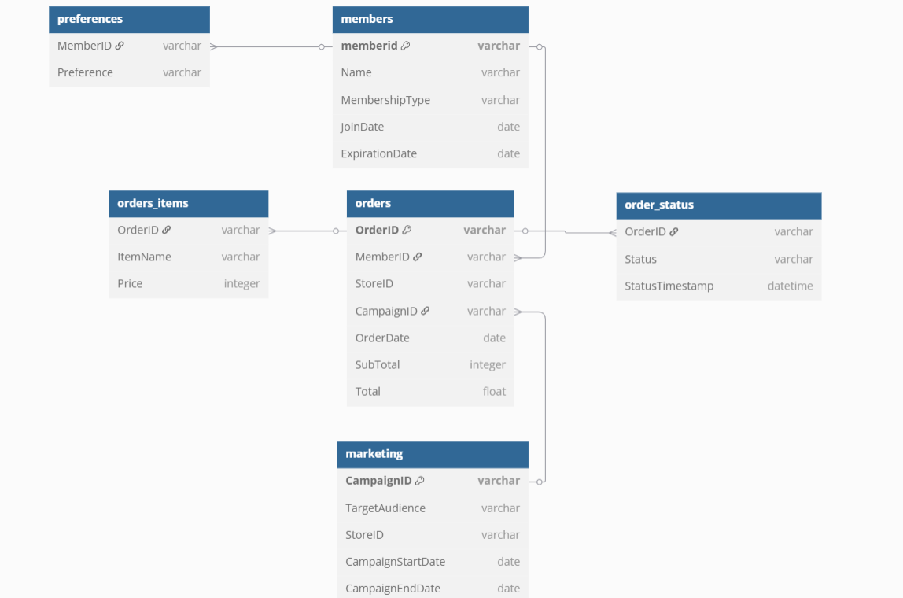
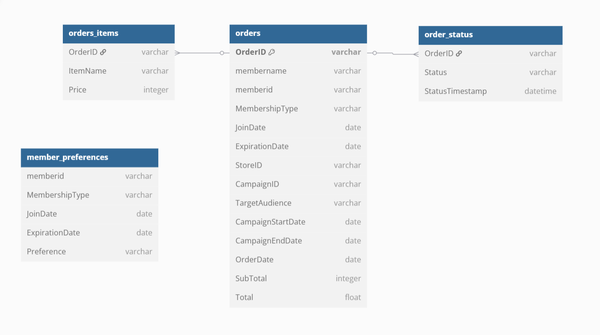
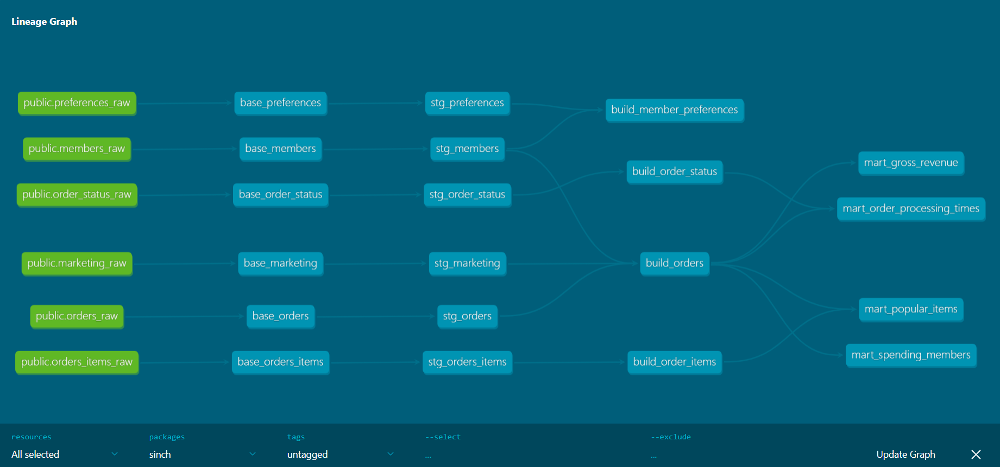

# PROJECT OVERVIEW
This repo contains a pipelie ingesting data thru python code into a postgres db and the transforming it using dbt framework.
The 2 main componets/modules are INGESTION and TRANSFORMATIONS

# Future Enhancement
- Orchestrate ingestion and transformation using airflow.
- create CI/CD pipelines, to create an image to be pushed to a container registry when new code is commited to a main branch.

# OVERVIEW INGESTION
This module uses a yml file based schema creation module.  
YML files are used to define schema, data type, indexes, partitions.  
Python code processes this and dinamically generates DDLs and execute schema creation for table, indexes and partitions.  
Python code ingest csv txt files, validates them agains yml file and inserts into database.  

## ASSUMPTIONS
- Files are already in our data lake(i.e S3)
- Files are delivered daily to the data lake
- The orders, order_items, order_status tables has the potential for billions of rows

## Decisions
- All but 1 table has data types as VARCHAR in the raw schema, by design we want to ingest EVERYTHING in the DW and clean it later.
- Partition by date was added only to the orders table. (order_status could have too)
- Because of this orderdate field has to be DATE type for the partition to work.
- Indexes were added to columns with JOIN potential to other tables, or potential with alot of queries.
- Uploads are done streaming the file, line by line and inserting to db in chunks of 10000, this makes it extremely memory efficient and suitable for large file ingestion.

## Future enhacements
- Extraction from SFTP, API, Other systems or databases into S3.
- Automatic schema evolution management, create alter statements dinamically based of schema.yml file.
- DockerFile to define image and upload to ECR.
- Upload data using multithreading and map to distributed uploads.

## Usage
USE DOCKER COMPOSE UP TO GET THE DB GOING
1. create virtual env
2. install ingestion/requirements.txt file
3. cd into exec/
4. run python run_schema_creation
5. run python run_data_load.py

## Documentation
You will find detailed documentation of classes and methods in ingestion/readme.md

# OVERVIEW TRANSFORMATIOS
This module uses dbt framework, to store sql transformations in a medallion architecture, including tests, and documentation.
Models are full loads or incremental loads based on a merge incremental strategy, out of the box test like unique, not null have been used but also custom test have been created like expected positive values.

## ASSUMPTIONS
- The tables provided are all the tables for each domain, if there were more per domain
- The orders table does not contain credits.

## DECISIONS
- Only orders models were created as an incremental model, processing only data equal or greater that the last orderdate.
- Medallion architecture, BRONZE to CAST data types, SILVER to deduplicate, GOLD to do joins and mart to do aggregations.
- In BRONZE zone, added warnings(this means job does not fail) for fields expected to be unique, this is to investigate why are we recieving duplicates.
- in SILVER, I deduplicate, enforce uniqueness and referencial integrity and added business logic tests like check the total amount has only positive values or that the start date of the campaing end date is greater than the start date.
- In GOLD zone, I joined orders with members and marketing, since they have a many to one and dont increase the grain, making queries faster for end users, also joined members with preferences to make member analytics available.
- in MART, contains specific scenarios requested from end users.
- ERD was created for SILVER since it is when Primary keys and Foreing keys are enforced, and also for GOLD...since it is the tables exposed to the end user.

## Future enhancements
- Use post hooks to drop base and stg models.
- add access layer to apply row level security or masking.
- Use multiple threads for concurrent jobs.
- DockerFile to define image and upload to ECR.
- Introduce dbt metrics semantic layer to manage metrics in a centrilized location.

## Usage
USE DOCKER COMPOSE UP TO GET THE DB GOING
1. create virtual env
2. install transfomations/requirements.txt file
3. cd into transfomations/dbt/sinch
4. run dbt deps (install packages)
5. run dbt build (this will run models and tests)

## Documentation
Documentation is generated in dbt automatically based on the schema yml files.
To see it, run:
- dbt docs generate
- dbt docs serve

# ERDs & Lineage
-- ERD Staging

-- ERD Gold

--Lineage

